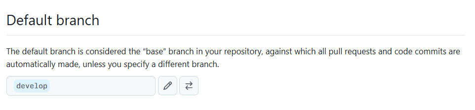
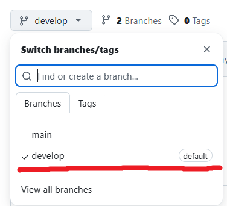
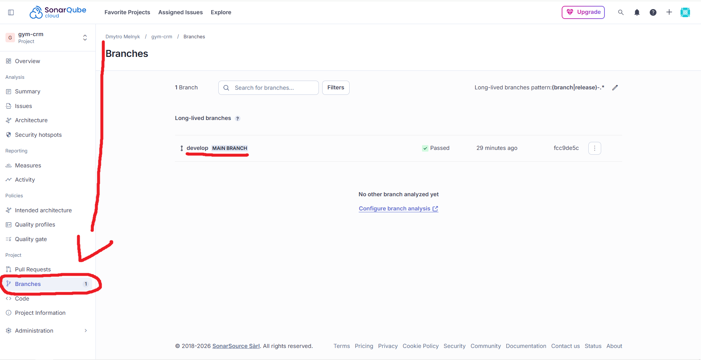

# Sonarcube actions example

## Prerequisites

- **Java Development Kit (JDK) 17 or higher**
- **Maven**
- **Git**

## Setup Instructions

### Set up github repository

1. Navigate to your GitHub repository Settings > General. In the Default branch section, click the switch icon (two arrows) and select develop from the dropdown menu. Click Update and confirm the change. As a result you should see:  

### Set up github actions
1. Add file with following path .github/workflows/ci.yml to your project


2. Configure file with code https://github.com/borderForNoone/gym-crm/blob/feature/GIA-77/.github/workflows/ci.yml#L1-L30 (without Build, test and analyze with SonarCloud step for now)


3. Create MR with this file


4. Go to "Settings" in your github repository and choose "Branches"


5. Add classic branch protection rule : paste develop branch for "Branch name pattern" and toggle buttons as in screenshot
   


6. Add check with name "Build and run tests + SonarCloud" (will be appeared when file will be merged or in MR)


### Set up Sonarcube
1. Register sonar cloud account with github. Link: https://sonarcloud.io/login


2. Create your organization with your github


3. Analyze your new project (make sure that develop is default branch before doing that)
   


4. Go to your project in sonar cloud click "Adminisration" and choose "Analysis Method" and turn off Automtic Analysis


5. Go to "My Account" and choose "Security"


6. Give any name to your token and generate it


7. After generation copy hashed token and save somewhere


8. Go to "Settings" in your github repository and choose "Secrets and variables" -> Actions


9. Create new secret


10. Type SONAR_TOKEN for name and type hashed token from sonar in secret which we get from step 6


11. Build plugins https://github.com/borderForNoone/gym-crm/blob/develop/pom.xml#L207-L235


12. Add your properties https://github.com/borderForNoone/gym-crm/blob/develop/pom.xml#L15-L17


13. Add to ci.yml config "Build, test and analyze with SonarCloud" step https://github.com/borderForNoone/gym-crm/blob/develop/.github/workflows/ci.yml#L32-L41


14. To obtain code coverage badge: Insert to README.md next three line (update links with your SonarQube project id)
    
    Please add to top of README.md:
```

[](https://sonarcloud.io/summary/overall?id=<SONAR_PROJECT_ID>)
[](https://sonarcloud.io/summary/overall?id=<SONAR_PROJECT_ID>)
```
Where:
CI_PATH - path for your CI yml file
SONAR_PROJECT_ID = project id from https://sonarcloud.io

Example for this repo:
CI_PATH = https://github.com/borderForNoone/gym-crm/actions/workflows/ci.yml
SONAR_PROJECT_ID = borderForNoone_gym-crm
```

[](https://sonarcloud.io/summary/overall?id=borderForNoone_gym-crm)
[](https://sonarcloud.io/summary/overall?id=borderForNoone_gym-crm)
```


15. Push changes to github and check if it works


16. After merging the pull request into develop and after CI pipeline, navigate to your project in SonarQube. Select Branches from the left-hand menu and ensure that develop is designated with the MAIN BRANCH label 